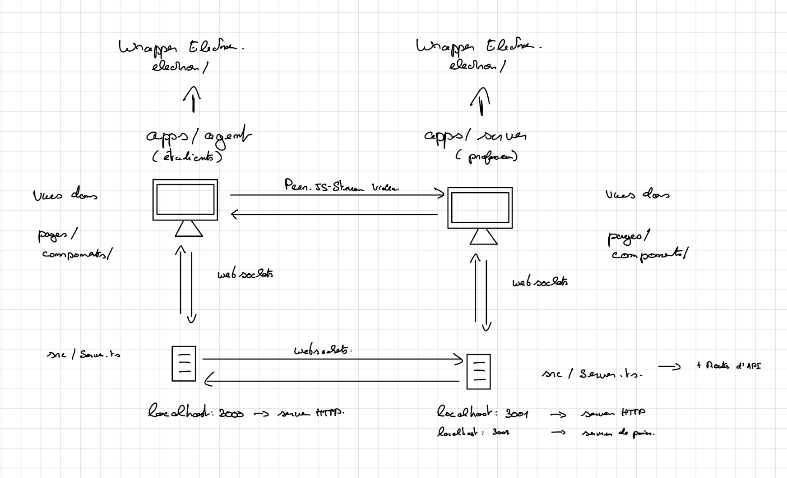

# IronProf documentation

## Project structure

### Packages directory

Packages can be used by the other packages in the repository and by the apps in the `apps/` directory. They can be imported in the apps using package.json and specifying the version `"*"`.

-   `packages/components` contains common components that are used by multiple workspaces. It can be imported using the name `@components/global`.
-   `packages/utils` contains common functions and hooks that are used by multiple workspaces. It can be imported using the name `@utils/global`.
-   `packages/eslint-config-custom` contains a custom ESLint configuration that can be used by the apps and packages in this repository.
-   `packages/gestures-controller` contains classes that can be used to extract gestures from Leap Motion data.
-   `packages/leapjs-types` contains type definitions for the Leap Motion SDK.
-   `packages/tsconfig` contains typescript configuration files for apps and packages in this repository.

### Apps directory

-   `apps/server` contains the source code of the IronProf teacher app. You can learn more about that app in the [teacher](apps/server/README.md) documentation file.

-   `apps/agent` contains the source code of the IronProf student app. You can learn more about that app in the [student](apps/agent/README.md) documentation file.

-   `apps/tests` is a test server for the gesture controller.

## Communication Mechanisms

Each app has its own WebSockets server this is used to pass information between the server and the GUI. The server also has a WebSockets server that is used to pass information between the `apps/server` and the `apps/agent`. `apps/agent` possesses a WebSockets server that is linked to its Websocket client.

Once the `apps/server` is started, it will create a Peer server on port 3002. This peer server is then used to create peer-to-peer connections between the `apps/server` GUI and the `apps/agent` GUI. It is mainly used to send Video and Audio data between the two apps.

`apps/server` can also expose API routes that can be used by the `apps/agent` to send data to the server. The API routes are defined in the `apps/server/src/Server.ts` file.

